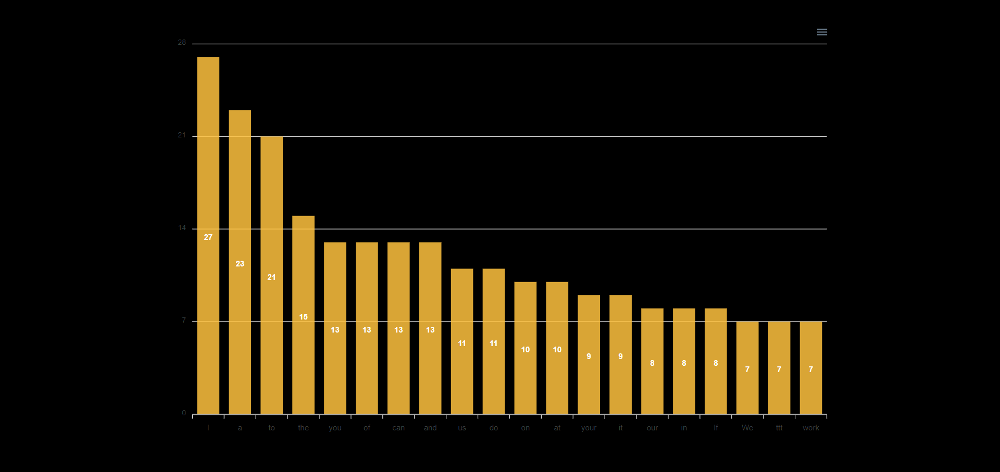
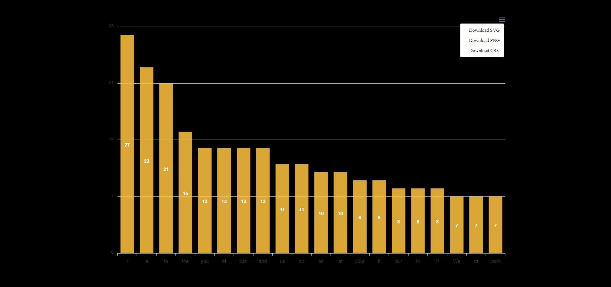
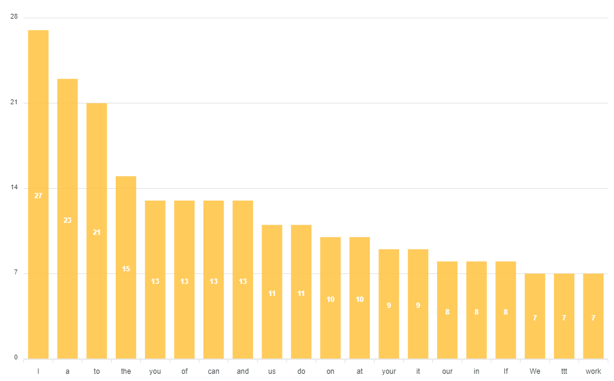

# Terribly Tiny Tales Assignment

## Screenshots of web page

### Home Page


### Charts



### Chart with download functionality



### Chart after download



## Library Used

- react-apexcharts
- apexcharts

## Code Components

- ### States of the app

  - To toggle the button show, when user clicks the button `showButton` will become false.
  - Array of words
  - Array of frequencies
  <p>&nbsp;</p>

  ```javascript
  const [showButton, setShowButton] = useState(true);
  const [words, setWords] = useState([]);
  const [frequencies, setFrequencies] = useState([]);
  ```

- ### Fetch data function

  - This function will be called when user clicks on the button
  - Reading file text
  - Calling function `findFrequencyOfWords(string)` to find frequency of words
  <p>&nbsp;</p>

  ```javascript
  const fetchData = async () => {
    try {
      setShowButton(false);
      const dataBuffer = await fetch(testData);
      const data = await dataBuffer.text();
      findFrequencyOfWords(data.toLowerCase());
    } catch (error) {
      console.log("Something went wrong while fetching data");
      console.log(error);
    }
  };
  ```

- ### Find Frequency function

  - This function will be called inside the `fetchData()`
  - Step 1 replacing all the characters like ! . ?
  - Step 2 converting string to array
  - Step 3 finding frequency of words and storing them in `freqMap` object
  - Step 4 converting object into array
  - Step 5 sorting frequency in descending order
  - Step 6 removing the empty character
  - Step 7 Creating two arrays of `wordsArray` and `frequencyArray` for charts library
  - Step 8 Storing in the state
  <p>&nbsp;</p>

  ```javascript
  const findFrequencyOfWords = (string) => {
    // Replacing characters and splitting into array
    let words = string.replace(/[,.!-?]+/g, "").split(/\s/);
    let freqMap = {};
    let wordFrequency = [];

    // Finding frequency of words
    words.forEach((word) => {
      if (!freqMap[word]) {
        freqMap[word] = 0;
      }
      freqMap[word] += 1;
    });

    // Converting object into array
    Object.keys(freqMap).forEach((word) => {
      let wordObject = { word: "", frequency: null };
      wordObject.word = word;
      wordObject.frequency = freqMap[word];
      wordFrequency.push(wordObject);
    });

    // Sorting wordFrequency array in descending order
    wordFrequency.sort((a, b) => b.frequency - a.frequency);

    // Removing the empty character from the array
    if (wordFrequency[0].word === "") {
      wordFrequency.shift();
    }

    // making two array words and frequencies
    let wordsArray = [];
    let frequencyArray = [];
    for (let i = 0; i < 20; i++) {
      wordsArray.push(wordFrequency[i].word);
      frequencyArray.push(wordFrequency[i].frequency);
    }
    setFrequencies(frequencyArray);
    setWords(wordsArray);
  };
  ```

- ### Options for chart

  - Options for apexcharts
  - Chart having id as `frequency-of-words`
  - Configuring x-axis should have words
  - Configuring y-axis should have frequencies
  - Configuring colors
  <p>&nbsp;</p>

  ```javascript
  const options = {
    chart: {
      id: "frequency-of-words",
    },
    xaxis: {
      categories: words,
    },
    colors: ["#ffc23e"],
    series: [
      {
        name: "frequency",
        data: frequencies,
      },
    ],
  };
  ```

- ### App Component

  - Rendering button based on `showButton` state
  - If `showButton` is true showing button
  - If `showButton` is false showing Chart
  - Button has a click function which will be called when user clicks on button
  <p>&nbsp;</p>

  ```javascript
  <div className="App">
    {showButton ? (
      <button className="btn" onClick={fetchData}>
        Submit
      </button>
    ) : (
      <Chart
        options={options}
        series={options.series}
        type="bar"
        width="1024px"
      />
    )}
  </div>
  ```
